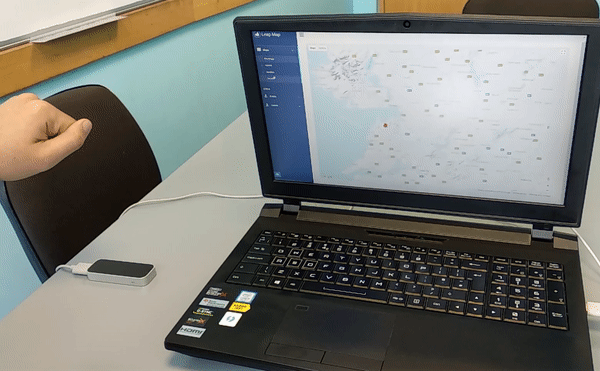

# 4 Year  GESTURE BASED UI DEVELOPMENT

## Overview
The Leap Motion system recognizes and tracks hands and fingers. The device operates in an intimate proximity with high precision and tracking frame rate and reports discrete positions and motion.


The Leap Motion controller uses optical sensors and infrared light. The sensors are directed along the y-axis – upward when the controller is in its standard operating position – and have a field of view of about 150 degrees. The effective range of the Leap Motion Controller extends from approximately 25 to 600 millimeters above the device (1 inch to 2 feet).

Detection and tracking work best when the controller has a clear, high-contrast view of an object’s silhouette. The Leap Motion software combines its sensor data with an internal model of the human hand to help cope with challenging tracking conditions.

## Coordinate system
The Leap Motion system employs a right-handed Cartesian coordinate system. The origin is centered at the top of the Leap Motion Controller. The x- and z-axes lie in the horizontal plane, with the x-axis running parallel to the long edge of the device. The y-axis is vertical, with positive values increasing upwards (in contrast to the downward orientation of most computer graphics coordinate systems). The z-axis has positive values increasing toward the user.


## How it works
We integrate the two Javascript APIs of Leap Motion, and of Google Maps, which allow us to achieve some amazing, downright futuristic hand gestures to manipulate Google Maps.


Using the hands on the device, the user will be able to control the courses on the map.

Some movements are pre-configured in the system, allowing the user to:

- Move the hand back and forth to close the popups;
- Open hand, move the cursor on the screen;
- Hand closed, mapping the map;
- Circular movements, zoom in and zoom out.

### Samples
Close the popups.


Navigate the map and control the zoom.




### Online at the following address.
## https://leapmapgmit.herokuapp.com/

## Technology

### Bootstrap
Bootstrap is an open source toolkit for developing with HTML, CSS, and JS. Quickly prototype your ideas or build your entire app with our Sass variables and mixins, responsive grid system, extensive prebuilt components, and powerful plugins built on jQuery.

```html
  <!-- Bootstrap -->
  <link href="vendors/bootstrap/dist/css/bootstrap.min.css" rel="stylesheet">
```

### Leap Motion - JS

This library aids manipulation of 2d surfaces in a 3D world. It depends on THREE.js and LeapJS. This is accomplished with a minimal API, no physics engine dependencies

With leap-widgets.js, two classes are added to the window namespace: InteractablePlane, and PushButton. Also a plugin named proximity is made available, which allows detection between either line segments and plane segments, or points and spheres.

This library expects Leap Motion and your THREE.js scene to be both in the same uniting system: meters. This effects things like collision detection (requiring same units) and some sane defaults (such as how far a button depresses).

See the demos below for how to set this up in a couple of lines.

```html
  <!-- Leap Motion - JS -->
  <script src="https://js.leapmotion.com/leap-0.6.0.min.js"></script>
  <script src="https://js.leapmotion.com/leap-plugins-0.1.6.js"></script>
  <script src="https://js.leapmotion.com/leap.rigged-hand-0.1.4.min.js"></script>
```

# Authors

### Alexander Souza
- G00317835@gmit.ie
- alexpt2000@gmail.com
- https://github.com/alexpt2000gmit
- https://github.com/alexpt2000
- www.linkedin.com/in/alexander-souza-3a841539/

### Pedro
- @gmit.ie
- https://github.com/
- www.linkedin.com/in//