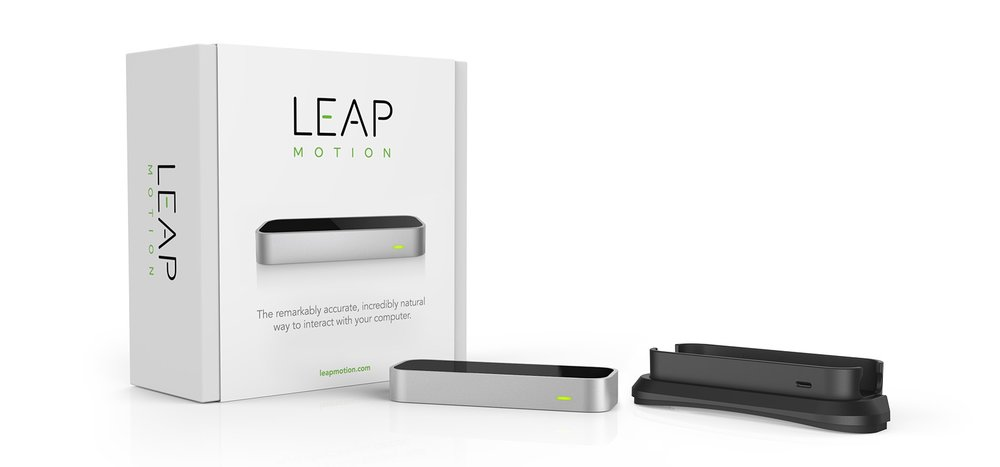
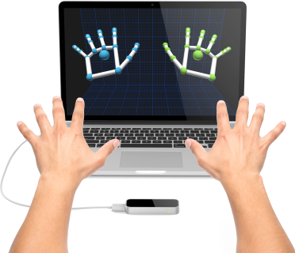

# 4 Year  GESTURE BASED UI DEVELOPMENT

## Overview
The Leap Motion system recognizes and tracks hands and fingers. The device operates in an intimate proximity with high precision and tracking frame rate and reports discrete positions and motion.

The Leap Motion controller uses optical sensors and infrared light. The sensors are directed along the y-axis – upward when the controller is in its standard operating position – and have a field of view of about 150 degrees. The effective range of the Leap Motion Controller extends from approximately 25 to 600 millimeters above the device (1 inch to 2 feet).

Detection and tracking work best when the controller has a clear, high-contrast view of an object’s silhouette. The Leap Motion software combines its sensor data with an internal model of the human hand to help cope with challenging tracking conditions.

## Coordinate system
The Leap Motion system employs a right-handed Cartesian coordinate system. The origin is centered at the top of the Leap Motion Controller. The x- and z-axes lie in the horizontal plane, with the x-axis running parallel to the long edge of the device. The y-axis is vertical, with positive values increasing upwards (in contrast to the downward orientation of most computer graphics coordinate systems). The z-axis has positive values increasing toward the user.

## How it works
We integrate the two Javascript APIs of Leap Motion, and of Google Maps, which allow us to achieve some amazing, downright futuristic hand gestures to manipulate Google Maps.

https://leapmapgmit.herokuapp.com/

# Authors

### Alexander Souza
- G00317835@gmit.ie
- alexpt2000@gmail.com
- https://github.com/alexpt2000gmit
- https://github.com/alexpt2000
- www.linkedin.com/in/alexander-souza-3a841539/

### Pedro
- @gmit.ie
- https://github.com/
- www.linkedin.com/in//